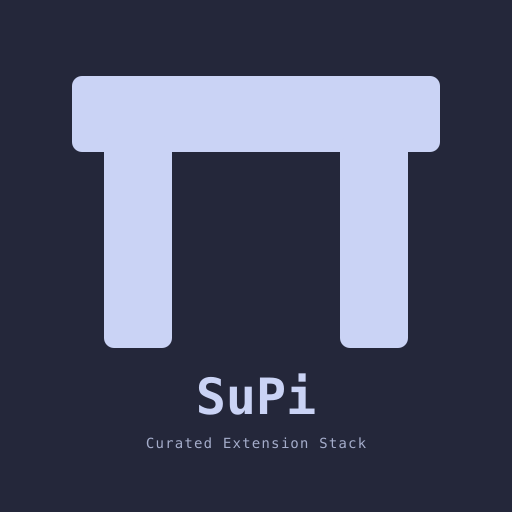

# SuPi (Super Pi)

SuPi is a curated extension toolkit for the [PI coding agent](https://github.com/earendil-works/pi): code understanding, external knowledge lookup, context and cache observability, structured decisions, review/reporting workflows, and quality-of-life in one package family.

It is also my daily PI setup, shared as installable packages so you can use the full stack or only the parts that fit your workflow.

## What SuPi is trying to achieve

- Make PI stronger in real coding sessions: code understanding, external docs lookup, session-aware review, reporting, diagnostics, and quality-of-life.
- Bring IDE-like navigation and tool-supported refactorings into agent workflows.
- Build with the initial context window in mind: focused tools, concise descriptions, and short guidelines.
- Make agent-user decisions structured when free-form chat would be ambiguous.
- Make sessions observable with context usage monitors, prompt-cache health, debug events, and usage insights.
- Stay modular: install the recommended stack or only the packages you want.

## Quick Start

Install the release SuPi stack globally:

```bash
curl -fsSL https://raw.githubusercontent.com/mrclrchtr/supi/main/scripts/install.sh | bash
```

Or install it project-locally into `.pi/settings.json`:

```bash
curl -fsSL https://raw.githubusercontent.com/mrclrchtr/supi/main/scripts/install.sh | bash -s -- -l
```

Want everything including beta packages? Use `install-all.sh` instead. Prefer a single package? Use any install command from the package cards below, for example:

```bash
pi install npm:@mrclrchtr/supi-code-intelligence
```

Run `/reload` in PI after installing new extensions.

## What you get

### Code understanding & IDE-like navigation

High-level code briefs, impact analysis, semantic navigation, AST-level structural inspection, and tool-supported refactorings.

Install [`@mrclrchtr/supi-code-intelligence`](packages/supi-code-intelligence#readme) for the full code-understanding stack. [`@mrclrchtr/supi-lsp`](packages/supi-lsp#readme) and [`@mrclrchtr/supi-tree-sitter`](packages/supi-tree-sitter#readme) are linked for lower-level details and direct use.

### External knowledge & project context

Fetch public web pages as clean Markdown, look up focused library docs, and keep repository-specific context close to the files where it matters.

Packages: [`supi-web`](packages/supi-web#readme), [`supi-claude-md`](packages/supi-claude-md#readme)

### Observability

See how the current session spends context, watch prompt-cache health, inspect cache regressions across sessions, and debug extension behavior when something looks wrong.

Packages: [`supi-context`](packages/supi-context#readme), [`supi-cache`](packages/supi-cache#readme), [`supi-debug`](packages/supi-debug#readme)

### Review & reporting

Run session-aware review workflows over git snapshots and generate reports from historical PI sessions.

Packages: [`supi-review`](packages/supi-review#readme), [`supi-insights`](packages/supi-insights#readme)

### Quality-of-life & structured decisions

Give the agent a richer way to ask focused questions, prevent hung shell commands from stalling a session, add ghost-text prompt suggestions, and small PI conveniences like aliases, prompt stashing, and activity indicators.

Packages: [`supi-ask-user`](packages/supi-ask-user#readme), [`supi-bash-timeout`](packages/supi-bash-timeout#readme), [`supi-extras`](packages/supi-extras#readme), [`supi-prompt-suggestions`](packages/supi-prompt-suggestions#readme)

## Configure SuPi

[`@mrclrchtr/supi-settings`](packages/supi-settings#readme) provides the shared `/supi-settings` TUI for project/global configuration exposed by SuPi packages.

```bash
pi install npm:@mrclrchtr/supi-settings
```

[Read package README →](packages/supi-settings#readme)

## Packages

Badges: <kbd>Agent</kbd> means PI can use the package directly through tools, injected context, or tool-call hooks. <kbd>Human</kbd> means the user drives it through commands, reports, shortcuts, or UI. <kbd>Beta</kbd> marks packages that are still stabilizing. <kbd>DevTool</kbd> marks packages primarily for debugging or extension development.

### Code understanding & IDE-like navigation

#### [@mrclrchtr/supi-code-intelligence](packages/supi-code-intelligence#readme)

<kbd>Agent</kbd>

Architecture briefs, caller/callee analysis, impact assessment, pattern search, and tool-supported refactorings. Recommended entry point for the full code-understanding stack.

```bash
pi install npm:@mrclrchtr/supi-code-intelligence
```

[Read package README →](packages/supi-code-intelligence#readme)

#### [@mrclrchtr/supi-lsp](packages/supi-lsp#readme)

<kbd>Agent</kbd> <kbd>Human</kbd>

Language Server Protocol support for semantic navigation, references, diagnostics, hover types, rename, and an LSP status view.

```bash
pi install npm:@mrclrchtr/supi-lsp
```

[Read package README →](packages/supi-lsp#readme)

#### [@mrclrchtr/supi-tree-sitter](packages/supi-tree-sitter#readme)

<kbd>Agent</kbd>

AST-level structural analysis for outlines, imports/exports, syntax nodes, custom queries, and outgoing callees.

```bash
pi install npm:@mrclrchtr/supi-tree-sitter
```

[Read package README →](packages/supi-tree-sitter#readme)

### External knowledge & project context

#### [@mrclrchtr/supi-web](packages/supi-web#readme)

<kbd>Agent</kbd>

Clean Markdown web fetching and focused library-documentation lookup for grounded agent research.

```bash
pi install npm:@mrclrchtr/supi-web
```

[Read package README →](packages/supi-web#readme)

#### [@mrclrchtr/supi-claude-md](packages/supi-claude-md#readme)

<kbd>Agent</kbd> <kbd>Beta</kbd>

Automatic subdirectory context-file discovery plus bundled skills for maintaining repository-specific agent guidance.

```bash
pi install npm:@mrclrchtr/supi-claude-md
```

[Read package README →](packages/supi-claude-md#readme)

### Observability

#### [@mrclrchtr/supi-context](packages/supi-context#readme)

<kbd>Human</kbd>

Detailed current-session context usage monitor for token budgets, active skills, guidelines, tool definitions, and injected context.

```bash
pi install npm:@mrclrchtr/supi-context
```

[Read package README →](packages/supi-context#readme)

#### [@mrclrchtr/supi-cache](packages/supi-cache#readme)

<kbd>Agent</kbd> <kbd>Human</kbd> <kbd>Beta</kbd>

Prompt-cache health monitoring and cross-session cache-regression forensics.

```bash
pi install npm:@mrclrchtr/supi-cache
```

[Read package README →](packages/supi-cache#readme)

#### [@mrclrchtr/supi-debug](packages/supi-debug#readme)

<kbd>Agent</kbd> <kbd>Human</kbd> <kbd>DevTool</kbd>

Shared debug-event capture, inspection commands, and an agent tool for troubleshooting SuPi/PI extension behavior.

```bash
pi install npm:@mrclrchtr/supi-debug
```

[Read package README →](packages/supi-debug#readme)

### Review & reporting

#### [@mrclrchtr/supi-review](packages/supi-review#readme)

<kbd>Human</kbd> <kbd>Beta</kbd>

Guided session-aware review over git snapshots with brief synthesis, plan preview, read-only reviewer agents, and structured findings.

```bash
pi install npm:@mrclrchtr/supi-review
```

[Read package README →](packages/supi-review#readme)

#### [@mrclrchtr/supi-insights](packages/supi-insights#readme)

<kbd>Human</kbd> <kbd>Beta</kbd>

Historical PI session analytics and shareable HTML reports for usage patterns.

```bash
pi install npm:@mrclrchtr/supi-insights
```

[Read package README →](packages/supi-insights#readme)

### Quality-of-life & structured decisions

#### [@mrclrchtr/supi-ask-user](packages/supi-ask-user#readme)

<kbd>Agent</kbd> <kbd>Human</kbd>

Keyboard-driven questionnaire UI for structured decisions when the agent needs focused input before continuing.

```bash
pi install npm:@mrclrchtr/supi-ask-user
```

[Read package README →](packages/supi-ask-user#readme)

#### [@mrclrchtr/supi-bash-timeout](packages/supi-bash-timeout#readme)

<kbd>Agent</kbd> <kbd>Beta</kbd>

Default timeouts for bash tool calls so a hung shell command does not stall the session.

```bash
pi install npm:@mrclrchtr/supi-bash-timeout
```

[Read package README →](packages/supi-bash-timeout#readme)

#### [@mrclrchtr/supi-extras](packages/supi-extras#readme)

<kbd>Human</kbd>

Aliases, skill shorthand, prompt stash overlay, activity indicators, and other PI session polish.

```bash
pi install npm:@mrclrchtr/supi-extras
```

[Read package README →](packages/supi-extras#readme)

#### [@mrclrchtr/supi-prompt-suggestions](packages/supi-prompt-suggestions#readme)

<kbd>Human</kbd>

Advisory ghost-text prompt suggestions after each assistant response, generated by a cheap model you choose.

```bash
pi install npm:@mrclrchtr/supi-prompt-suggestions
```

[Read package README →](packages/supi-prompt-suggestions#readme)

## Infrastructure packages

These packages support the extension stack and are linked for maintainers and extension authors. They are not promoted as standalone PI extensions.

- [`@mrclrchtr/supi-core`](packages/supi-core#readme) — shared infrastructure for SuPi extensions, including configuration, settings, path helpers, reporting, and session utilities.
- [`@mrclrchtr/supi-code-runtime`](packages/supi-code-runtime#readme) — shared workspace context, capability contracts, and canonical types for the code-understanding stack.
- [`@mrclrchtr/supi-test-utils`](packages/supi-test-utils#readme) — shared test helpers for SuPi extension packages.

## Install details

### Release stack

Global install:

```bash
curl -fsSL https://raw.githubusercontent.com/mrclrchtr/supi/main/scripts/install.sh | bash
```

Project-local install into `.pi/settings.json`:

```bash
curl -fsSL https://raw.githubusercontent.com/mrclrchtr/supi/main/scripts/install.sh | bash -s -- -l
```

The release script installs the stable SuPi packages from npm.

### Full stack (release + beta)

Global install:

```bash
curl -fsSL https://raw.githubusercontent.com/mrclrchtr/supi/main/scripts/install-all.sh | bash
```

Project-local install into `.pi/settings.json`:

```bash
curl -fsSL https://raw.githubusercontent.com/mrclrchtr/supi/main/scripts/install-all.sh | bash -s -- -l
```

The full-stack script adds beta packages on top of the release set. Run `/reload` in PI after installation.

### Individual packages

```bash
pi install npm:@mrclrchtr/supi-web
pi install npm:@mrclrchtr/supi-review
```

Use any package name from the catalog above.

### Full workspace from git or local path

```bash
pi install git:github.com/mrclrchtr/supi
```

```bash
pi install /path/to/supi
```

The repo root includes the workspace extension manifest for development and full-stack local installs. When installed from a local path, PI loads the working tree directly; after edits, use `/reload` or restart PI.
