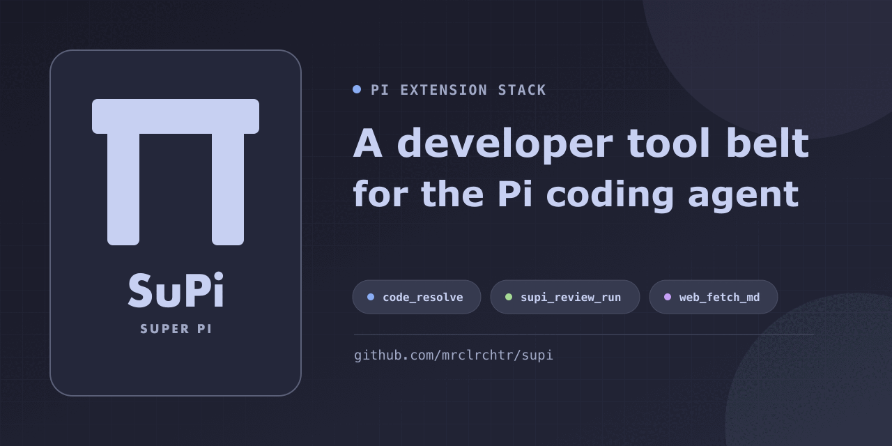

# SuPi — Extension Stack for the Pi Coding Agent

SuPi (short for **Super Pi**) is an open-source TypeScript extension stack for the [Pi coding agent](https://github.com/earendil-works/pi). It adds LSP and Tree-sitter code intelligence, semantic refactoring, parallel code review, web and Context7 documentation access, structured ask-user forms, scoped skill controls, quick skill input, and context/cache observability.

Install the recommended stack or pick only the packages you need. You keep prompting Pi normally; SuPi gives the agent additional tools and context it can use directly.

> SuPi is pre-release. Packages marked beta are the fastest-moving parts of the stack.

## The key difference: LSP + AST for the agent

Most coding agents can read files and search text. [`@mrclrchtr/supi-code-intelligence`](packages/supi-code-intelligence/README.md) gives Pi direct, model-callable access to two complementary sources of code intelligence:

- **Language servers (LSP)** provide types, definitions, references, implementations, diagnostics, workspace symbols, and semantic refactoring.
- **Tree-sitter ASTs** provide syntax, outlines, source structure, structural search, and outgoing calls.

The agent receives focused `code_*` tools for workspace orientation, precise symbol inspection, relationship analysis, code-aware search, live health, and safe refactor previews. Results disclose their evidence and say when semantic or structural analysis is unavailable instead of silently guessing.

Tree-sitter support is bundled. Full LSP features require the matching language-server binary on `PATH`; see the [Code Intelligence setup and screenshots](packages/supi-code-intelligence/README.md#language-support).

[![Code Intelligence showing LSP references and AST calls][code-intelligence]][code-intelligence]

[See all Code Intelligence screenshots →](packages/supi-code-intelligence/README.md#see-it-in-action)

## What else your agent gets

- **Web access built for agents** — [`supi-web`](packages/supi-web/README.md) prefers source Markdown, extracts readable content from public HTML, fences plain-text files, and moves long pages to temporary files instead of flooding the context window.
- **Focused library docs** — search Context7 for the right project and version, then retrieve documentation narrowed to the current task.
- **Structured decisions** — ask you focused choice or text questions through a keyboard-driven form with [`supi-ask-user`](packages/supi-ask-user/README.md).
- **Review workflows** — run independent, inspection-only reviews over a working tree, branch comparison, or commit with [`supi-review`](packages/supi-review/README.md).
- **Agent Profile policy** — discover explicit `explore` and `general` profiles with bounded resource envelopes through [`supi-agent`](packages/supi-agent/README.md).
- **Operational awareness** — inspect context pressure, prompt-cache health, and SuPi debug events with `supi-context`, `supi-cache`, and `supi-debug`.
- **Repository guidance** — maintain `CLAUDE.md` and `AGENTS.md` files with the skills in [`supi-claude-md`](packages/supi-claude-md/README.md).
- **Skills on your terms** — use [`supi-skills`](packages/supi-skills/README.md) to choose, globally or per project, whether Pi can select each skill automatically, whether only you can start it, or whether it is disabled. Type `$` to search and start installed skills without remembering their full command names.
- **Session polish** — prompt stashing, shortcuts, activity indicators, advisory prompt suggestions, and default shell timeouts.

## Install

After any installation, run `/reload` or restart Pi.

### Recommended release stack

Global installation:

```bash
curl -fsSL https://raw.githubusercontent.com/mrclrchtr/supi/main/scripts/install.sh | bash
```

Project-local installation into `.pi/settings.json`:

```bash
curl -fsSL https://raw.githubusercontent.com/mrclrchtr/supi/main/scripts/install.sh | bash -s -- -l
```

### Release stack plus beta packages

Global installation:

```bash
curl -fsSL https://raw.githubusercontent.com/mrclrchtr/supi/main/scripts/install-all.sh | bash
```

Project-local installation into `.pi/settings.json`:

```bash
curl -fsSL https://raw.githubusercontent.com/mrclrchtr/supi/main/scripts/install-all.sh | bash -s -- -l
```

> Pi extensions run with your user permissions. Review [`install.sh`](scripts/install.sh) or [`install-all.sh`](scripts/install-all.sh) before piping either script to a shell.

### One package

Every extension package is independently installable:

```bash
pi install npm:@mrclrchtr/supi-code-intelligence
```

```bash
pi install npm:@mrclrchtr/supi-web
```

## Package catalog

### Release stack

| Package | What it adds | Install |
|---|---|---|
| [`supi-code-intelligence`](packages/supi-code-intelligence/README.md) | Direct LSP- and AST-backed code understanding, navigation, search, health, and refactoring tools | `pi install npm:@mrclrchtr/supi-code-intelligence` |
| [`supi-web`](packages/supi-web/README.md) | Direct public-page-to-Markdown fetching, context-safe large output, and focused Context7 documentation | `pi install npm:@mrclrchtr/supi-web` |
| [`supi-ask-user`](packages/supi-ask-user/README.md) | Structured choice and text forms for focused agent-user decisions | `pi install npm:@mrclrchtr/supi-ask-user` |
| [`supi-context`](packages/supi-context/README.md) | Context-pressure snapshots and detailed TUI usage reports | `pi install npm:@mrclrchtr/supi-context` |
| [`supi-settings`](packages/supi-settings/README.md) | One project/global settings UI for SuPi packages | `pi install npm:@mrclrchtr/supi-settings` |
| [`supi-skills`](packages/supi-skills/README.md) | Scoped skill controls and `$skill-name` input shortcuts | `pi install npm:@mrclrchtr/supi-skills` |
| [`supi-extras`](packages/supi-extras/README.md) | Prompt stash, shortcuts, activity indicators, and other session conveniences | `pi install npm:@mrclrchtr/supi-extras` |
| [`supi-prompt-suggestions`](packages/supi-prompt-suggestions/README.md) | Advisory ghost-text suggestions from a model you choose | `pi install npm:@mrclrchtr/supi-prompt-suggestions` |

### Adapted skills

The root [`skills/`](skills) catalog contains SuPi-compatible editions of selected third-party skills. Install only the skills you need:

```bash
npx skills add mrclrchtr/supi --skill code-review research
```

[`supi-skill-patches`](packages/supi-skill-patches/README.md) is the private maintenance workspace that synchronizes and validates this catalog.

### DevTools

Not part of the recommended release stack. Included in the full-stack installer (`install-all.sh`), or install separately:

| Package | What it adds | Install |
|---|---|---|
| [`supi-debug`](packages/supi-debug/README.md) | Shared debug-event capture and bounded troubleshooting tools | `pi install npm:@mrclrchtr/supi-debug` |

### Beta additions

Installed by `install-all.sh` on top of the release stack:

| Package | What it adds | Install |
|---|---|---|
| [`supi-review`](packages/supi-review/README.md) | Caller-defined, inspection-only reviews in managed child sessions | `pi install npm:@mrclrchtr/supi-review` |
| [`supi-agent`](packages/supi-agent/README.md) | Explicit Agent Profile catalogue and child resource policy | `pi install npm:@mrclrchtr/supi-agent` |
| [`supi-cache`](packages/supi-cache/README.md) | Prompt-cache monitoring and cross-session regression forensics | `pi install npm:@mrclrchtr/supi-cache` |
| [`supi-insights`](packages/supi-insights/README.md) | Historical session analytics and shareable HTML reports | `pi install npm:@mrclrchtr/supi-insights` |
| [`supi-claude-md`](packages/supi-claude-md/README.md) | Skills for auditing and revising repository instruction files | `pi install npm:@mrclrchtr/supi-claude-md` |
| [`supi-bash-timeout`](packages/supi-bash-timeout/README.md) | Default timeouts so forgotten shell limits do not stall the session | `pi install npm:@mrclrchtr/supi-bash-timeout` |

### Internal libraries

These packages power the stack and are not standalone Pi extensions:

- [`supi-lsp`](packages/supi-lsp/README.md) — Language Server Protocol runtime bundled by Code Intelligence.
- [`supi-tree-sitter`](packages/supi-tree-sitter/README.md) — structural AST analysis bundled by Code Intelligence.
- [`supi-code-runtime`](packages/supi-code-runtime/README.md) — shared code-intelligence contracts and workspace capability state.
- [`supi-agent-runtime`](packages/supi-agent-runtime/README.md) — neutral in-memory Agent Run lifecycle, usage accounting, and bounded diagnostics for extension-owned adapters.
- [`supi-core`](packages/supi-core/README.md) — common configuration, settings, reporting, and session infrastructure.
- [`supi-test-utils`](packages/supi-test-utils/README.md) — shared test helpers for SuPi packages.

## Configure

The release stack includes [`supi-settings`](packages/supi-settings/README.md). Open the shared settings UI with:

```text
/supi-settings
```

Press Tab to switch between project and global scope. Settings show whether each value comes from the project, global configuration, or its default.

### Control skills

[`supi-skills`](packages/supi-skills/README.md) adds a searchable **Skills** section to `/supi-settings`. Each installed skill can be:

- **Enabled** — Pi can select the skill automatically, and you can start it explicitly.
- **Model invocation disabled** — only you can start the skill explicitly.
- **Disabled** — Pi does not load the skill or its command.

At the prompt, type `$` and part of a skill name. Select a result to insert `$skill-name`; SuPi runs it as `/skill:skill-name` when you submit. For example, if `code-review` is installed:

```text
$code-review Review the current changes.
```

Project choices inherit your global choices. Run `/reload` after you change whether a skill loads, or after you add or remove skills.

The release installers include both `supi-skills` and `supi-settings`. For a standalone installation with skill controls, install both packages:

```bash
pi install npm:@mrclrchtr/supi-settings
pi install npm:@mrclrchtr/supi-skills
```

## Update and remove

Update installed Pi packages:

```bash
pi update --extensions
```

Remove the release stack:

```bash
curl -fsSL https://raw.githubusercontent.com/mrclrchtr/supi/main/scripts/uninstall.sh | bash
```

Remove the release-plus-beta stack:

```bash
curl -fsSL https://raw.githubusercontent.com/mrclrchtr/supi/main/scripts/uninstall-all.sh | bash
```

For project-local removal, add `-s -- -l` to either command:

```bash
curl -fsSL https://raw.githubusercontent.com/mrclrchtr/supi/main/scripts/uninstall.sh | bash -s -- -l
```

Remove one package:

```bash
pi uninstall npm:@mrclrchtr/supi-web
```

Run `/reload` or restart Pi after removing extensions.

## License

[MIT](LICENSE)

[code-intelligence]: https://raw.githubusercontent.com/mrclrchtr/supi/main/packages/supi-code-intelligence/assets/relationship-graph.png
