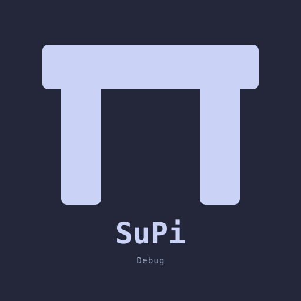

# @mrclrchtr/supi-debug

Adds shared debug-event capture and inspection for SuPi extensions in the [pi coding agent](https://github.com/earendil-works/pi).

## Install

```bash
pi install npm:@mrclrchtr/supi-debug
```

For local development:

```bash
pi install ./packages/supi-debug
```

After editing the source, run `/reload`.


## What you get

After install, this package wires the shared debug registry into three user-facing surfaces:

- `/supi-debug` — show recent debug events in a readable TUI report
- `supi_debug` — let the model query recent debug events during troubleshooting
- `/supi-settings` integration — configure whether events are captured and how much data is exposed

It also registers a **Debug** provider section for `/supi-context`.

## Event behavior

- events are session-local
- the event buffer is cleared on `session_start`
- if debug capture is disabled, no events are retained
- agent-facing access is blocked, sanitized, or raw depending on settings

## Rendering

`/supi-debug` uses a custom TUI message renderer that shows two levels of detail:

- **Collapsed** (default) — a one-line summary:

  ```
  3 events — rtk/rewrite +2 more
  ```

- **Expanded** — full details with timestamp, level, source/category, message, cwd,
  and data for each event. **Click/expand the collapsed message** in the TUI to reveal
  the full output.

Rendered fields per event:

- timestamp
- level
- `source/category`
- message
- optional `cwd`
- optional `data`
- optional `rawData`

### Why collapsed by default

Event payloads can be large (full command strings, structured data). Collapsing
keeps the conversation focused; expand only when you need the details.

### Seeing full details without expanding

The agent-facing `supi_debug` tool always returns the expanded plain-text
representation, which is useful for automated troubleshooting flows.

## Filters

Both `/supi-debug` and `supi_debug` support the same basic filters:

- `source`
- `level`
- `category`
- `limit`

The tool also accepts:

- `includeRaw` — request raw event data when settings allow it

## Settings

This package registers a **Debug** section in `/supi-settings`.

Available settings:

- `enabled` — turn session-local event capture on or off
- `agentAccess` — `off`, `sanitized`, or `raw`
- `maxEvents` — maximum retained events in memory
- `notifyLevel` — minimum severity that may notify the user: `off`, `warning`, or `error`

Defaults come from the shared debug registry:

```json
{
  "debug": {
    "enabled": false,
    "agentAccess": "sanitized",
    "maxEvents": 100,
    "notifyLevel": "off"
  }
}
```

## Extra status logging

If `SUPI_LOG_STATUS` is enabled in the environment, the package emits a SuPi load-status marker to stderr on `session_start` and appends the same payload as a session entry.

## Source

- `src/debug.ts` — settings, command, tool, and registry wiring
- `src/renderer.ts` — custom report renderer
- `src/format.ts` — debug payload formatting
- `src/status-log.ts` — optional load-status logging
