# @mrclrchtr/supi-flow

**Lightweight spec-driven workflow for pi.**

Brainstorm → plan → apply → archive. Optional tndm ticket tracking for multi-session changes.

## Flow

```mermaid
flowchart TD
    START(["Start a change"]) --> BRAIN
    BRAIN["/skill:supi-flow-brainstorm
         HARD-GATE: no code yet
         Explore, design, approve"]
    BRAIN --> APPROVED{Design approved?}
    APPROVED -->|"No"| BRAIN
    APPROVED -->|"Yes"| TICKET{"Multi-session
         change?"}

    TICKET -->|"Yes"| TNDM["tndm ticket create --todo
         Body: Intent + Design + Plan + Verification"]
    TICKET -->|"No"| NOPLAN["Design stays in
         conversation context"]

    TNDM --> PLAN
    NOPLAN --> PLAN

    PLAN["/skill:supi-flow-plan [ID]
         Bite-sized tasks
         Exact file paths
         No placeholders
         TDD: red-green-refactor"]
    PLAN --> APPROVE2{"Plan approved?"}
    APPROVE2 -->|"No"| PLAN
    APPROVE2 -->|"Yes"| APPLY

    APPLY["/skill:supi-flow-apply [ID]
         Iron Law: fresh verify each task
         TDD gate: test-first or delete
         Commit after each task"]
    APPLY --> BLOCKED{"Verification
         failed?"}

    BLOCKED -->|"Yes"| DEBUG["/skill:supi-flow-debug
         4-phase systematic debugging
         3-fix → question architecture"]
    DEBUG --> FIXED{Fixed?}
    FIXED -->|"Yes"| APPLY
    FIXED -->|"No"| USER["Talk to user
         before fix #4"]

    BLOCKED -->|"No"| DONE{"All tasks
         done?"}
    DONE -->|"No"| APPLY
    DONE -->|"Yes"| ARCHIVE

    ARCHIVE["/skill:supi-flow-archive [ID]
         Fresh verification (gate function)
         Update living documentation
         Slop-scan docs
         Quality gate checklist"]
    ARCHIVE --> SLOP["/skill:supi-flow-slop-detect
         Tier 1-4 vocabulary
         11 structural patterns
         Score target: < 1.5"]
    SLOP --> QGATE{"Quality gate
         passes?"}
    QGATE -->|"No"| SLOP
    QGATE -->|"Yes"| CLOSE

    CLOSE["tndm ticket --status done
         git commit"]

    classDef phase fill:#e8f5e9,stroke:#4caf50,stroke-width:2
    classDef decision fill:#e3f2fd,stroke:#2196f3
    classDef entry fill:#e8e8e8,stroke:#666
    classDef blocker fill:#ffebee,stroke:#f44336

    class BRAIN,PLAN,APPLY,ARCHIVE,CLOSE phase
    class APPROVED,TICKET,APPROVE2,BLOCKED,FIXED,DONE decision
    class START entry
    class USER blocker
```



## Skills

Pi discovers these skills from the package and exposes them as `/skill:<name>` commands:

| Skill | When |
|-------|------|
| `supi-flow-brainstorm` | Start of any change; HARD-GATE before implementation |
| `supi-flow-plan` | After design approval; creates an implementation plan |
| `supi-flow-apply` | After plan approval; executes tasks one by one |
| `supi-flow-archive` | After all tasks are done; verifies, documents, closes |
| `supi-flow-debug` | On demand during apply; systematic debugging protocol |
| `supi-flow-slop-detect` | On demand during archive; AI-prose detection |

## Prompt templates

Pi also discovers bundled prompt templates from the package:

| Prompt | Description |
|--------|-------------|
| `/supi-coding-retro` | Retrospective on project setup, architecture, tooling, workflows, and conventions |

## Commands

| Command | Description |
|---------|-------------|
| `/supi-flow` | List available flow commands |
| `/supi-flow-status` | Show active tndm tickets in session history |

## Usage

```bash
# Install
pi install npm:@mrclrchtr/supi-flow

# Workflow
/skill:supi-flow-brainstorm     # or $supi-flow-brainstorm
/skill:supi-flow-plan [TNDM-ID]
/skill:supi-flow-apply [TNDM-ID]
/skill:supi-flow-archive [TNDM-ID]
/supi-coding-retro
/supi-flow-status
```

Tickets are optional. Small single-session changes skip tndm entirely, and plans live in conversation context.

## Dependencies

- **tndm CLI** (optional): ticket tracking for multi-session changes.
- **pi**: discovers the bundled skills and prompt templates automatically from the package.

## Inspiration

Distills the best parts of [OpenSpec](https://github.com/Fission-AI/OpenSpec) (artifact structure, checkbox tracking), [Superpowers](https://github.com/obra/superpowers) (HARD-GATE before implementation, verification iron law, bite-sized tasks, no placeholders, systematic debugging), and [Claude Night Market](https://github.com/athola/claude-night-market) (slop-detection vocabulary, documentation quality gates), without the CLI, config files, or multi-file ceremony.
