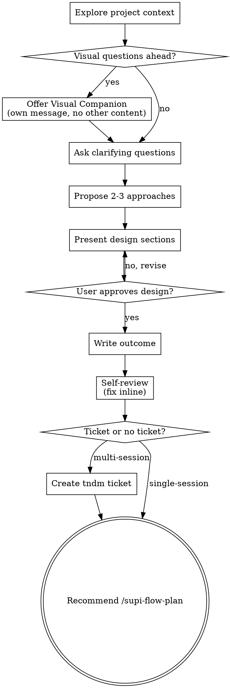

# Flow Brainstorm

Help turn ideas into fully formed designs through natural collaborative dialogue. Output is an approved design — implementation comes after.

<HARD-GATE>
Do NOT write code, scaffold anything, or take implementation action until you have presented a design and the user has approved it. This applies to EVERY change regardless of perceived simplicity.
</HARD-GATE>

## Process Flow



The terminal state is recommending `/supi-flow-plan`. Do NOT invoke any implementation skill, write code, or scaffold anything. `/supi-flow-plan` is the next step.

## Checklist

Complete these in order:

1. **Explore project context** — check relevant files, docs, recent commits, existing tndm tickets
2. **Offer visual companion** (if topic will involve visual questions) — this is its own message, not combined with a clarifying question. See the Visual Companion section below.
3. **Ask clarifying questions** — one at a time, understand purpose/constraints/success criteria. If the request describes multiple independent subsystems, flag this immediately and decompose before detailing.
4. **Propose 2-3 approaches** — with trade-offs and your recommendation
5. **Present design** — in sections scaled to complexity, get user approval after each section
6. **Write outcome** — capture the approved direction
7. **Self-review** — check for placeholders, contradictions, ambiguity, scope
8. **Ticket or no ticket?** — create tndm ticket for multi-session work, skip for single-session changes

## Understanding the idea

- Check out the current project state first (files, docs, recent commits, existing tickets)
- Before asking detailed questions, **assess scope**: if the request describes multiple independent subsystems (e.g., "build a platform with chat, file storage, billing, and analytics"), flag this immediately. Don't spend questions refining details of a project that needs to be decomposed first.
- If the change is too large for a single spec, help the user decompose into sub-changes: what are the independent pieces, how do they relate, what order should they be built? Then brainstorm the first sub-change through the normal flow. Each sub-change gets its own brainstorm → plan → implementation cycle.
- For appropriately-scoped changes, ask questions one at a time to refine the idea
- Prefer multiple choice questions when possible, but open-ended is fine too
- Only one question per message — if a topic needs more exploration, break it into multiple questions
- Focus on understanding: purpose, constraints, success criteria

## Visual Companion

A visual aid for showing mockups, diagrams, and visual options during brainstorming. Available as a pattern — not a dependency. Accepting the companion means it's available for questions that benefit from visual treatment; it does NOT mean every question goes through a visual channel.

**Offering the companion:** When you anticipate that upcoming questions will involve visual content (mockups, layouts, diagrams), offer it once for consent:
> "Some of what we're working on might be easier to explain if I can show it to you visually. I can put together mockups, diagrams, comparisons, and other visuals as we go. Want to try it?"

**This offer MUST be its own message.** Do not combine it with clarifying questions, context summaries, or any other content. The message should contain ONLY the offer above and nothing else. Wait for the user's response before continuing. If they decline, proceed with text-only brainstorming.

**Per-question decision:** Even after the user accepts, decide FOR EACH QUESTION whether to use a visual aid or the terminal. The test: **would the user understand this better by seeing it than reading it?**

- **Use visual aids** for content that IS visual — mockups, wireframes, layout comparisons, architecture diagrams, side-by-side visual designs
- **Use the terminal** for content that is text — requirements questions, conceptual choices, tradeoff lists, A/B/C/D text options, scope decisions

A question about a UI topic is not automatically a visual question. "What does personality mean in this context?" is conceptual — use the terminal. "Which wizard layout works better?" is visual — use a visual aid.

## Exploring approaches

- Propose 2-3 different approaches with trade-offs
- Present options conversationally with your recommendation and reasoning
- Lead with your recommended option and explain why

## Presenting the design

- Scale each section to its complexity: a few sentences if straightforward, up to 200-300 words if nuanced
- Ask after each section whether it looks right so far
- Cover: approach, components, data flow, error handling, testing
- Be ready to go back and clarify if something doesn't make sense

## Design for isolation and clarity

- Break the system into smaller units that each have one clear purpose, communicate through well-defined interfaces, and can be understood and tested independently
- For each unit, you should be able to answer: what does it do, how do you use it, and what does it depend on?
- Can someone understand what a unit does without reading its internals? Can you change the internals without breaking consumers? If not, the boundaries need work.
- Smaller, well-bounded units are also easier for you to work with — you reason better about code you can hold in context at once, and your edits are more reliable when files are focused. When a file grows large, that's often a signal that it's doing too much.

## Testing

Default is TDD for code changes. For trivial or obviously untestable changes (e.g., a standalone shell script with no harness, a pure config edit), it's fine to rely on manual verification. No formal declaration required — `/supi-flow-plan` can mark individual tasks as test-exempt if needed.

## Working in existing codebases

- Explore the current structure before proposing changes. Follow existing patterns.
- Where existing code has problems that affect the work (e.g., a file that's grown too large, unclear boundaries, tangled responsibilities), include targeted improvements as part of the design — the way a good developer improves code they're working in.
- Don't propose unrelated refactoring. Stay focused on what serves the current goal.

## After design approval: ticket or no ticket?

Ask the user:

> "Create a tndm ticket to track this? Recommended for multi-session work. Skip for small changes done in one session."

**If ticket:** create it via the `ticket` skill.

**If no ticket:** the design lives in the conversation. Continue with `/supi-flow-plan`.

## Self-review (before handing off)

1. **Placeholder scan:** Any "TBD", "TODO", incomplete sections, or vague requirements? Fix them.
2. **Internal consistency:** Do any sections contradict each other? Does the architecture match the feature descriptions?
3. **Scope check:** Is this focused enough for a single implementation plan, or does it need decomposition?
4. **Ambiguity check:** Could any requirement be interpreted two different ways? If so, pick one and make it explicit.

Fix any issues inline. No need to re-review — just fix and move on.

## Handoff

Present the outcome:

```markdown
## Brainstorming Outcome
**Problem**: ...
**Recommended approach**: ...
**Why**: ...
**Constraints / non-goals**: ...
**Open questions**: ...
**Ticket**: TNDM-XXXXXX / none
```

Then recommend: `/supi-flow-plan [TNDM-XXXXXX]` to create the implementation plan.

## Key Principles

- **One question at a time** — Don't overwhelm with multiple questions
- **Multiple choice preferred** — Easier to answer than open-ended when possible
- **YAGNI ruthlessly** — Remove unnecessary features from all designs
- **Explore alternatives** — Always propose 2-3 approaches before settling
- **Incremental validation** — Present design, get approval before moving on
- **Be flexible** — Go back and clarify when something doesn't make sense
